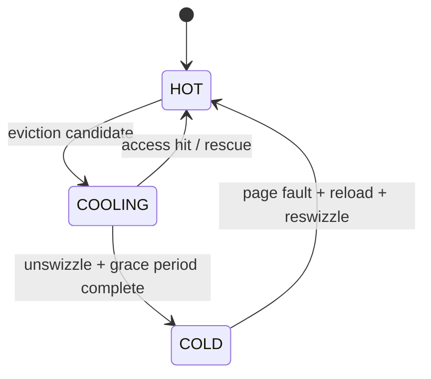

# Pointer Swizzle/Unswizzle Protocol for B-Tree Pages (bd-2uza4.1)

## Scope

This document defines the pointer swizzle protocol for B-tree child references:

- Tagged pointer representation (`SwizzlePtr`).
- Atomic swizzle/unswizzle transitions.
- HOT/COOLING/COLD page residency state machine.
- Concurrency safety with epoch-based reclamation (EBR).
- Recovery behavior after process crash.
- Structured logging contract for protocol observability.

This is intentionally a design-first artifact with a small, testable Rust prototype in `crates/fsqlite-btree/src/swizzle.rs`.

## Goals and Non-Goals

Goals:
- Replace selected `PageId` child references with direct frame pointers when safe.
- Guarantee no dangling-pointer follow on unswizzle under concurrency.
- Keep deterministic fallback available (`all unswizzled`) when swizzle path is disabled or degraded.

Non-goals (this bead):
- Full buffer-pool integration with parent back-reference indexes.
- Full EBR wiring across all eviction paths.
- Throughput tuning of the full swizzle lifecycle.

## Data Model

### Tagged Word Format

`SwizzlePtr` is a `repr(transparent)` abstraction over `AtomicU64`.

| Bit(s) | Meaning |
| --- | --- |
| bit 0 | tag: `0 = unswizzled`, `1 = swizzled` |
| bits 1..63 (unswizzled) | `PageId` encoded as `page_id << 1` |
| bits 1..63 (swizzled) | aligned frame address with bit 0 clear |

Constraints:
- `PageId <= (u64::MAX >> 1)`.
- Swizzled frame addresses must be aligned so bit 0 is always clear.

### Rust Prototype Surface

```rust
pub enum SwizzleState {
    Unswizzled { page_id: u64 },
    Swizzled { frame_addr: u64 },
}

pub enum PageTemperature { Hot, Cooling, Cold }

pub struct SwizzlePtr { /* AtomicU64 */ }
```

The prototype provides:
- `new_unswizzled`, `new_swizzled`.
- `try_swizzle(expected_page_id, frame_addr)` (CAS).
- `try_unswizzle(expected_frame_addr, page_id)` (CAS).
- temperature transition validation.

## Swizzle/Unswizzle Protocol

### Swizzle

Preconditions:
1. Target page is resident in buffer pool and has stable frame address.
2. Parent-child mapping confirms `parent_ptr == unswizzled(page_id)`.
3. Caller holds appropriate latch/ownership for parent page pointer array edit.

Operation:
1. Encode expected unswizzled word (`page_id << 1`).
2. Encode replacement swizzled word (`frame_addr | 1`).
3. `compare_exchange(expected, replacement, AcqRel, Acquire)`.
4. On CAS success, pointer becomes swizzled atomically for all readers.
5. On CAS failure, re-read state and retry or abort path based on caller policy.

### Unswizzle

Preconditions:
1. Eviction candidate frame is in COOLING state.
2. Parent references to candidate are enumerable (reverse-map / parent index).
3. EBR grace period protection is available.

Operation:
1. Mark frame COOLING.
2. For each parent reference, CAS from expected swizzled word to unswizzled `PageId`.
3. Publish unswizzle completion.
4. Wait for EBR grace period so readers with old pointer views drain.
5. Transition frame to COLD and allow physical eviction.

Safety property:
- No reader may observe freed frame memory if unswizzle publication + grace period completion occur before reclamation.

## Concurrency Safety Analysis

### Reader Safety Contract

Readers:
1. Load tagged word atomically (`Acquire`).
2. If unswizzled, route through normal page lookup.
3. If swizzled, treat frame as protected by current epoch pin.

Writers/evictors:
1. Perform pointer transition with `AcqRel` CAS.
2. Never free frame memory until EBR reports grace-period completion.

This enforces a no-dangling-follow contract under lock-free reads.

### Failure Modes

| Failure mode | Detection | Fallback |
| --- | --- | --- |
| CAS contention on pointer transition | CAS returns observed value | Retry with bounded attempts or leave unswizzled |
| Misaligned frame address | encode validation failure | reject transition, leave unswizzled |
| Parent index incomplete during unswizzle | transition audit mismatch | block eviction, keep COOLING, retry repair |
| EBR unavailable/degraded | health check / capability missing | force unswizzled-only mode |

Deterministic fallback behavior is always legal: keep references unswizzled and continue using PageId lookup.

## Root Pinning

Root pages for each B-tree remain permanently HOT and swizzled:
- Root frames are excluded from eviction candidate lists.
- Root pin decisions are emitted at `INFO` level.
- On recovery, root frames are re-established lazily on first access and then pinned.

## HOT/COOLING/COLD State Machine

Allowed transitions:
- `HOT -> COOLING`
- `COOLING -> HOT` (rescued by access)
- `COOLING -> COLD` (eviction path)
- `COLD -> HOT` (fault and reload)
- identity transitions allowed

Forbidden direct transition:
- `HOT -> COLD` (must pass through COOLING)



## Buffer Pool and EBR Integration Points

Buffer-pool integration:
1. Parent-reference index maintenance for child pointers.
2. Eviction scanner consults `PageTemperature`.
3. Eviction finalizer calls unswizzle protocol before frame reclaim.

EBR integration:
1. Reader path pins epoch before swizzled dereference.
2. Evictor retires frame memory only after grace period.
3. Epoch pressure metrics feed cooling window tuning.

## Recovery Protocol

On process crash/restart:
1. In-memory frame pointers are invalid by definition.
2. All child refs start unswizzled (PageId form).
3. Normal page loads progressively re-swizzle hot references.
4. Root pages are re-pinned when loaded.

No on-disk format changes are required for this protocol.

## Iterator API and Ownership Boundaries

Proposed iterator interaction:
- Cursor descent reads `SwizzlePtr`.
- Iterator remains agnostic to encoding details via `SwizzleState`.
- Pointer transition ownership belongs to buffer-pool/eviction subsystem, not cursor.

Ownership boundaries:
- `fsqlite-btree`: tagged pointer type + transition semantics.
- buffer pool: residency policy + parent-reference index + eviction scheduling.
- MVCC/EBR: grace period enforcement before reclaim.

## Structured Logging Contract

Required fields for swizzle events:
- `trace_id`
- `run_id`
- `scenario_id`
- `bead_id`
- `op` (`swizzle` | `unswizzle` | `temperature_transition` | `root_pin`)
- `page_id`
- `frame_addr` (nullable for unswizzled-only events)
- `from_state` / `to_state` (for temperature transitions)
- `outcome` (`pass` | `fail` | `retry`)
- `duration_us`
- `error_code` (nullable)

Log levels:
- `TRACE`: swizzle/unswizzle high-frequency events.
- `DEBUG`: HOT/COOLING/COLD transitions.
- `INFO`: root pinning and unswizzled-only fallback mode toggles.

Conformance check:
- E2E pilot script validates required JSON fields are present and non-empty where mandated.

## Pilot E2E Scenario

Scenario artifact:
- Script: `e2e/bd_2uza4_1_swizzle_protocol_pilot.sh`
- Deterministic seed: `2026021501`
- Replay command emitted in summary JSON
- Artifacts: run log + JSONL summary + SHA256 digests

Pilot purpose:
- Prove prototype state transitions and CAS semantics behave deterministically.
- Validate structured logging schema for the swizzle protocol surface.
